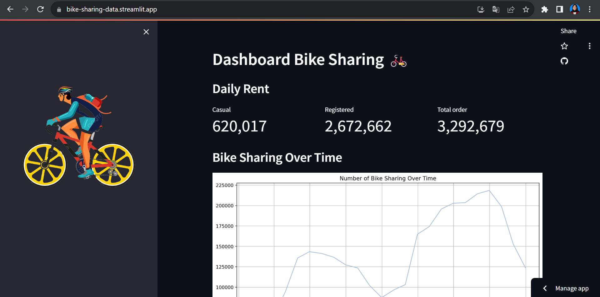
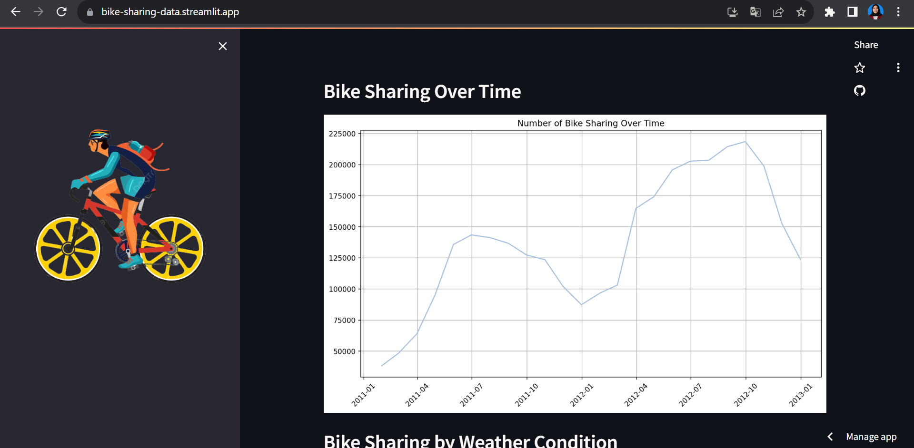
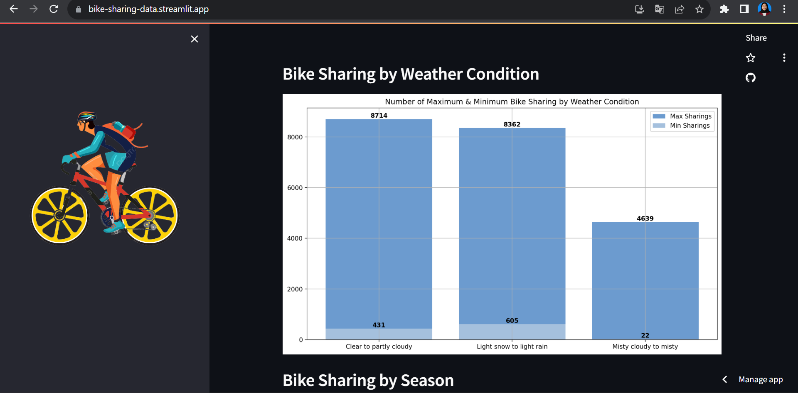
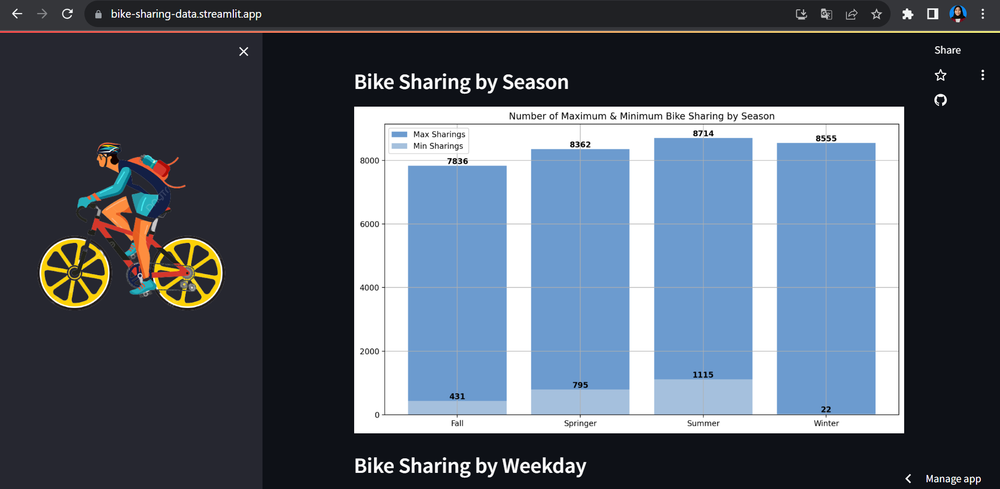
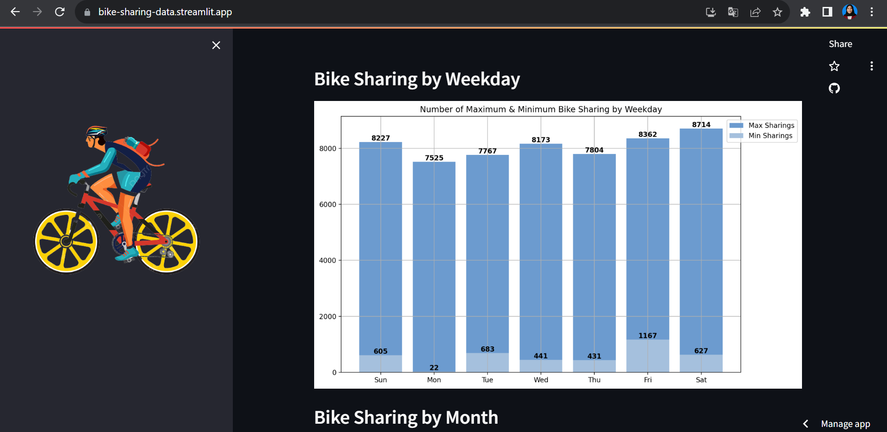
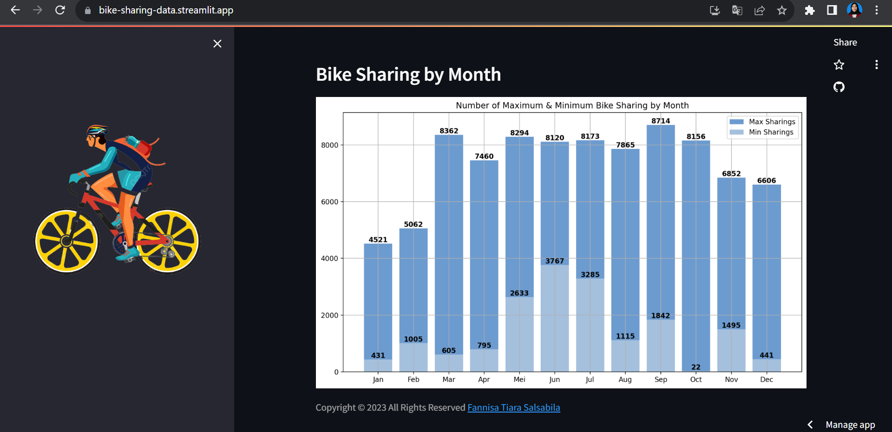

# Bike Sharing Dashboard 

## Streamlit Cloud 
Link Streamlit : <a href='https://bike-sharing-data.streamlit.app/' target='_blank' title='Bike Sharing Dashboard  | Streamlit'>Bike Sharing Dashboard</a>

## Screenshot Dashboard







## Directory

- `/dashboard`: Berisi file utama yang ditampilkan untuk dashboard, 1 dataset yang telah dibersihkan, serta 1 gambar untuk dashboard.
- `/data` : Berisi dataset yang digunakan untuk analisis yaitu Bike Sharing Dataset.
- `notebook.ipynb` : file jupyter notebook yang berisi analisis data yang dilakukan.
- `README.md` : informasi tentang cara menjalankan dashboard.
- `requirements.txt` : berisi berbagai library yang digunakan dalam proses analisis data. 

## How to run the dashboard

1. Clone This Repository
```
git clone "https://github.com/fannisatiara/bike-sharing-dashboard.git"
```
2. Install This library
```
pip install numpy pandas matplotlib seaborn jupyter streamlit
```

3. Run Streamlit
```
streamlit run dashboard\dashboard.py
```